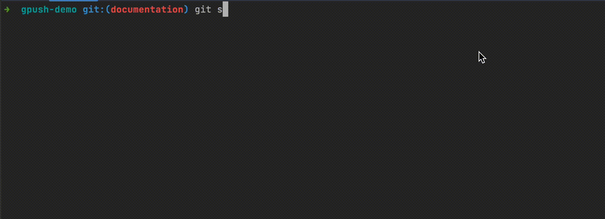

# gpush

`gpush` is a command line utility for standardising commit messages using [Conventional Commits](https://www.conventionalcommits.org/en/v1.0.0/). It is designed to be used in conjunction with [python-semantic-release](https://python-semantic-release.readthedocs.io/en/latest/) to automate the release of your python package based on commits that are made on a branch.

# Installation

This package is available for installation via pypi using pip3:

```
pip3 install gpush
```

# Usage

When running gpush in a git directory, use `gpush` to replace your standard `git commit && git push` commands. `gpush` will ask a few questions to determine detail about your commit and generate a conventionally formatted git commit message.



To see additional options available, run gpush with the  `--help` flag

```
gpush --help
```

# Local development

To develop locally, uninstall any existing version of gpush before executing the pip3 installation in the local directory, use Makefile command to do this

```
make dev
```

# Unit tests

To run unit tests, execute the following command, you will need to have pytest installed and set environment
variable `GITHUB_TOKEN` to a valid GitHub token that has permissions to create/delete and push to a repository
within your account.

```
make test
```

The unit tests will create a test repository within your account for each unit test before testing functionality and deleting the repository.

# python-semantic-release

`gpush` generates commit messages that are compliant with [python-semantic-release](https://python-semantic-release.readthedocs.io/en/latest/). This allows you to automate the release of your python package using GitHub Actions.

To use python-semantic-release, you will need to create a GitHub Action workflow that runs on the `main` branch. The workflow will need to checkout the code, install python-semantic-release and then run the release command. The following is an example workflow that will run on the `main` branch and release a new version of your package and push to PyPI when a PR is merged.

You will need to create a PyPI token and add it to your GitHub repository secrets (As `PYPI_TOKEN`). You can find instructions on how to do this [here](https://packaging.python.org/guides/publishing-package-distribution-releases-using-github-actions-ci-cd-workflows/#publishing-to-pypi).

## .github/workflow/release.yml
```yaml
name: Semver Bump
on:
  push:
    branches:
      - "main"

jobs:
  auto-semver:
    runs-on: "ubuntu-latest"
    steps:
      - name: "Checkout code"
        uses: "actions/checkout@v3"
        with:
          fetch-depth: 0
      - name: "Python Semantic Release"
        uses: "python-semantic-release/python-semantic-release@master"
        with:
          github_token: ${{ secrets.GITHUB_TOKEN }}
          repository_username: __token__
          repository_password: ${{ secrets.PYPI_TOKEN }}

```
